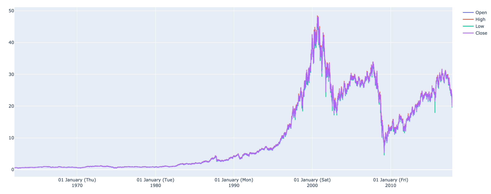
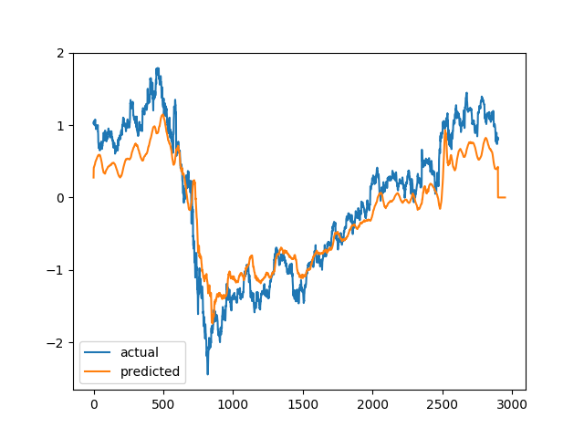

# Kaggle stock (GE stock since 1962) prediction using LSTM

## GE stock change overview

## GE stock prediction on test set (displayed are Zscore normalized value)

### Puzzling things to think about:
#### 1. Rescale z score normalized values to the orignal scale
#### 2. The ideal scenerio is to use the current time window stock values to predict future time window stock values, and use the predicted future time window values to continue doing predictions while maintaining a good performance. Based on the post I've read online, this way of modeling is not done frequently possibly due to poor prediction accuracies. 
